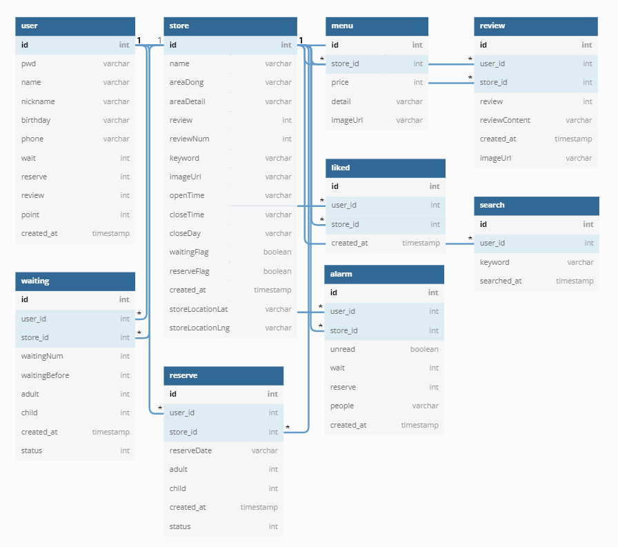

# 웨이링 (Wait-Ring)

## Description
원격 웨이팅 서비스로, 인기 음식점 정보 제공 및 리뷰 공유,
음식점 웨이팅/예약 신청을 위한 리액트 웹앱입니다.

 


### 기획/설계
- [화면 설계 (Figma)](https://www.figma.com/file/AsbTomoY56L7CQqMFpSG2k/WaitRing?node-id=0%3A1)


- [DB 설계 (dbdiagram)](https://dbdiagram.io/d/62afce309921fe2a963a0a63)



### Goals

+ 화면 설계를 기반으로 화면을 만들 수 있다
+ 재사용성을 위해, 최대한 작은 컴포넌트 단위로 분리할 수 있다
+ 라우팅을 통해 SPA를 구현할 수 있다
+ <s>미디어쿼리를 통해 반응형 웹을 만들 수 있다</s>


## Quick Start
+ install
```
git clone https://github.com/callu9/wait-ring
npm install
```
+ run
```
npm start
```


## TODO

+ 반응형 웹을 위한 미디어쿼리 적용
    + [ref. 블로그 (반응형 웹을 만들어보자)](https://coding-hwije.tistory.com/21)
+ 소셜 로그인/회원가입 적용
    + [ref. 블로그 (React로 카카로, 네이버 소셜 로그인 구현하기)](https://2dowon.netlify.app/react/social_login/)
+ CRUD 위한 Firebase 적용
    + [ref. 유튜브 영상 (Firebase로 당근마켓 만들기)](https://www.youtube.com/watch?v=9RkXchEJgKU&list=PLfLgtT94nNq3PzZinqs9Afuiai--r5NB_&index=1&t=8s)
    + [ref. 블로그 (React X Firebase)](https://hong-jh.tistory.com/entry/%ED%8C%8C%EC%9D%B4%EC%96%B4%EB%B2%A0%EC%9D%B4%EC%8A%A4-X-%EB%A6%AC%EC%95%A1%ED%8A%B8-CRUD%EA%B5%AC%ED%98%841?category=1179153)
    + [ref. 블로그 (React X Firebase, 소셜 로그인)](https://velog.io/@dev-hannahk/react-firebase-crud#--%EC%86%8C%EC%85%9C-%EB%A1%9C%EA%B7%B8%EC%9D%B8--google--github)
+ 웹페이지 정적 배포
    + Netlify 
    + [ref. 블로그 (React 프로젝트, 정적 사이트 Netlify에 배포하기)](https://goddaehee.tistory.com/306)
+ PWA 전환
    + [ref. 블로그 (React 앱을 PWA로 만들기)](https://kwanghyuk.tistory.com/200)
+ 점포용 웨이링 서비스 제작
